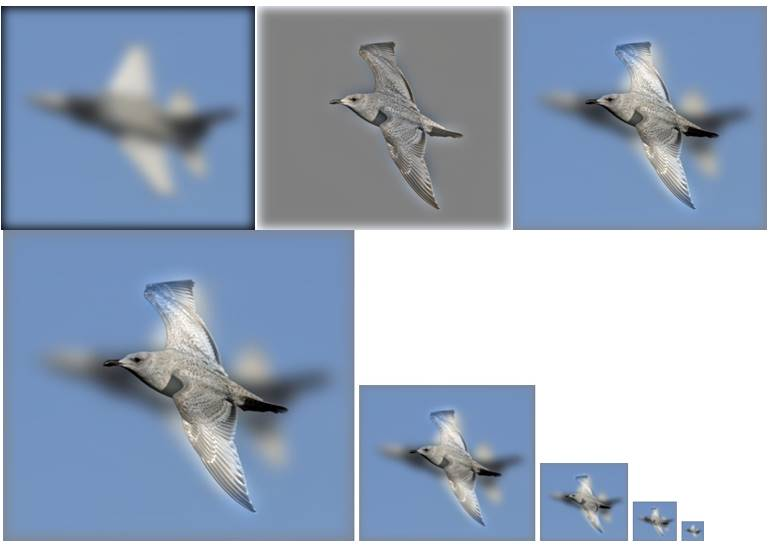
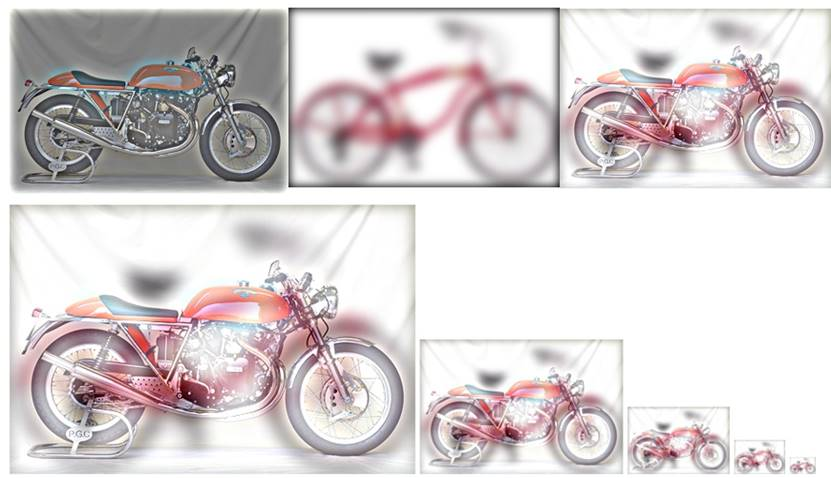
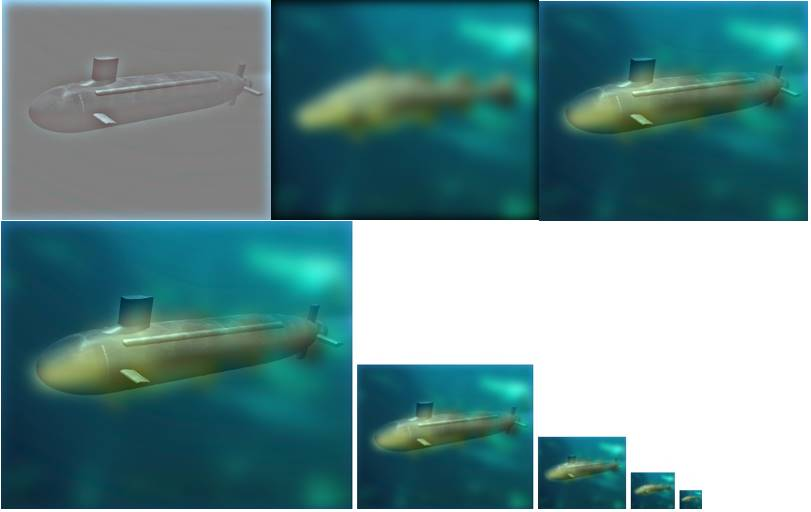

# DIP

[TOC]

## 代码执行结果

### Bird-Plane pair



​																				  飞机与鸟

### Motorcycle-bicycle pair 



​																				  自行车与摩托车

### Fish-Submarine pair 



​                                                                                      潜艇与鱼

## 代码说明

###  proj1.m (运行模块)

```matlab
close all; 

%读取图像
image1 = im2single(imread('../data/einstein.bmp'));
image2 = im2single(imread('../data/marilyn.bmp'));

%设置截断频率
cutoff_frequency = 12; 

%设立高斯低通滤波器
filter = fspecial('Gaussian', cutoff_frequency*4+1, cutoff_frequency);

%进行高斯低通滤波，得到低通分量 （调用了my_imfilter.m的函数）
low_frequencies = my_imfilter(my_imfilter(image1, filter), filter');

%减去低频得到高频分量
high_frequencies = image2 - my_imfilter(my_imfilter(image2, filter), filter');

%结合低频和高频分量
hybrid_image = low_frequencies + high_frequencies;

%可视化并保存结果
figure(1); imshow(low_frequencies)
figure(2); imshow(high_frequencies + 0.5);
vis = vis_hybrid_image(hybrid_image); %调用vis_hybrid_image.m中的函数
figure(3); imshow(vis);
imwrite(low_frequencies, 'low_frequencies.jpg', 'quality', 95);
imwrite(high_frequencies + 0.5, 'high_frequencies.jpg', 'quality', 95);
imwrite(hybrid_image, 'hybrid_image.jpg', 'quality', 95);
imwrite(vis, 'hybrid_image_scales.jpg', 'quality', 95);
```

### my_imfilter.m（自定义滤波器模块）

```matlab
function output = my_imfilter(image, filter)

intput_image = image;

% 获取输入图像的行和列大小，并过滤以允许多尺寸图像
[intput_row, intput_col] = size(intput_image(:,:,1));
[filter_row, filter_col] = size(filter);

% 用零填充图像(数量=过滤器的最小需求=行和列的一半)
pad_input_image = padarray(intput_image, [(filter_row - 1)/2, (filter_col - 1)/2]);

output = [];

for layer = 1:size(intput_image, 3) % 当输入是灰色图像时，确保正常
    % 使输入图像的所有filter_row*filter_col大小块都是列
    columns = im2col(pad_input_image(:,:,layer), [filter_row, filter_col]);
    
    % 转置滤波器，使其卷积(但不相关)
    filter2 = transpose(filter(:));
    
    % 过滤图像
    filterd_columns = filter2 * columns;
    
    % 从列恢复到图像形式s
    output(:,:,layer) = col2im(filterd_columns, [1, 1], [intput_row, intput_col]);
end
```

### vis_hybrid_image.m（可视化模块）

```matla
function output = vis_hybrid_image(hybrid_image)
%通过逐步向下采样图像并将所有图像连接在一起，可视化混合图像。

scales = 5; %5个下采样版本
scale_factor = 0.5; %每次下采样缩小2倍
padding = 5; %像素填充5

original_height = size(hybrid_image,1);
num_colors = size(hybrid_image,3); %计算图像通道数
output = hybrid_image;
cur_image = hybrid_image;

for i = 2:scales
    %填充部分
    output = cat(2, output, ones(original_height, padding, num_colors));
    
    %下采样图像
    cur_image = imresize(cur_image, scale_factor, 'bilinear');
    %合并图像
    tmp = cat(1,ones(original_height - size(cur_image,1), size(cur_image,2), num_colors), cur_image);
    output = cat(2, output, tmp);    
end
```

## 运行环境与运行方式

环境： matlab2014a

运行方式：直接运行**proj1.m**，需要自行设定图像路径