# 图像增强综述

这篇文章是DIP的第二次作业，对图像增强技术进行综述，目录如下:happy:：

- Point Operations
  - Image Negative
  - Contrast Stretching
  - Compression of dynamic range
  - Grey level slicing
  - Image Subtraction
  - Image Averaging
  - Histogram
    - Histogram Equalization
    - adaptive histogram equalization
    - Contrast Limited Adaptive Hitogram Equalization（CLAHE）
- Mask Operations
  - Smoothing operations
  - Median Filtering
  - sharpening operations
  - Derivative operations
- Transform operations
  - Low pass filtering
  - High pass filtering
  - Band pass filtering
  - Homomorphic filtering
- Coloring Operations
  - False coloring
  - Full color processing
- Reference


## 1. Point Operations 

### 1.1 Image Negative

图像反转（Image Negative）在许多应用中都很有用，例如显示医学图像和用单色正片拍摄屏幕，其想法是将产生的负片用作投影片。

转换方程：$T: G(x, y) = L - F(x,y)​$，其中$L​$是最大强度值，灰度图像$L​$为255。

实验结果：

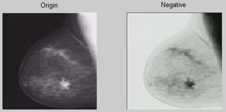

source code: 

```matlab
%% 图像反转
L = 255;
img_orig = imread('mammogram.png');
figure();
subplot(1, 2, 1);
imshow(img_orig);
title('Origin');
img_negative = L - img_orig;
subplot(1, 2, 2);
imshow(img_negative);
title('Negative');
```

### 1.2 Contrast Stretching

低对比度的图像可能是由于光照不足，图像传感器缺乏动态范围，甚至在图像采集过程中透镜孔径设置错误。对比度拉伸（Contrast Stretching）背后的想法是增加图像处理中灰度的动态范围。

转换公式：$G(x, y) = g_1 + (g_2 - g_1)/ (f_2 - f_1)[F(x, y) - 1]$，其中这里$[f1, f2]$为灰度在新范围$[g1, g2]$上的映射，这里f1为图像的最小强度值，f2为图像的最大强度值。该函数增强了图像的对比度，显示了均匀的强度分布。

实验结果：

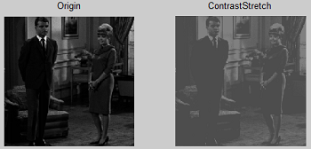

source code: 

```matlab
%% 对比度拉伸
imgContrastStretch=imadjust(imgOrig, [0.1 0.4], [0.3 0.5 ])
figure();
subplot(1, 2, 1);
imshow(imgOrig);
title('Origin');
subplot(1, 2, 2);
imshow(imgContrastStretch);
title('ContrastStretch');
```

### 1.3 Compression of dynamic range

有时，处理后的图像的动态范围远远超过显示设备的能力，在这种情况下，只有图像最亮的部分在显示屏上可见. 则需要对图像进行动态范围压缩（Compression of dynamic range）。

转换公式：$s = c log(1 + |r|)​$， $c​$是度量常数，是对数函数执行所需的压缩。$r​$表示当前像素的灰度，$s​$为转换后该像素的灰度。例如将以下图像的$[0. 255]​$压缩到$[0, 150]​$，其中$c = \frac{150}{log(1 + 255)}​$.

实验结果：

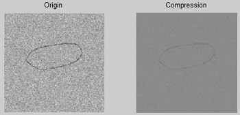

source code: 

```matlab
%% 动态范围压缩
img_orig1 = rgb2gray(imread('circle.png'));
c = 150 / log(1 + 255);
img_size = size(img_orig1);
for i = 1:img_size(1)
    for j = 1:img_size(2)
        s(i, j) = c * log(double(1 + img_orig1(i, j)));
    end
end
figure();
subplot(1, 2, 1);
imshow(img_orig1);
title('Origin');
subplot(1, 2, 2);
imshow(uint8(s));
title('Compression');
```

### 1.4 Grey level slicing

灰度切片(Grey level slicing)相当于带通滤波的空间域。灰度切片函数既可以强调一组灰度值而减少其他所有灰度值，也可以强调一组灰度值而不考虑其他灰度值。例如对图像中灰度值为[100, 180]的区域进行强调，对其他区域进行抑制。

实验结果：

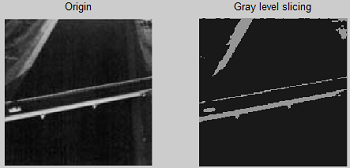

source code: 

```matlab
%% 灰度切片
img_orig2 = rgb2gray(imread('GLS.png'));
figure();
subplot(1, 2, 1);
imshow(img_orig2);
title('Origin');
img_size = size(img_orig2);
for i = 1:img_size(1)
    for j = 1:img_size(2)
        if img_orig2(i, j) > 100 || img_orig2(i, j) > 180
            img_orig2(i, j) = 150;
        else
            img_orig2(i, j) = 25;
        end
    end
end
subplot(1, 2, 2);
imshow(img_orig2);
title('Gray level slicing');
```

### 1.5 Image Subtraction

图像相减是从另一个图像中减去一个像素或整个图像的数字数值的过程。这主要是出于两个原因——调平图像的不均匀部分和检测两幅图像之间的变化。一个常用的方法是从场景中减去背景光照的变化，以便更容易地分析其中的前景对象.例如在捕获过程中光照很差的文本，以便在整个图像中有很强的光照梯度，如果我们希望将前景文本从背景页面中分离出来，也许我们不能调整光照，但是我们可以在场景中放入不同的东西。例如，显微镜成像通常就是这样。所以我们用一张白纸替换文本，在不改变任何东西的情况下，我们捕捉到一个新的图像。我们可以从原始图像中减去光场图像，试图消除背景强度的变化。
实验结果如下：

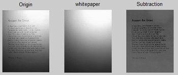

source code: 

```matlab
%% 图像相减
img_orig3 = rgb2gray(imread('son1.png'));
img_add = uint16(img_orig3) + 100;
whitepaper = rgb2gray(imread('son2.png'));
img_sub = uint8(img_add - uint16(whitepaper));
figure();
subplot(1, 3, 1);
imshow(img_orig3);
title('Origin');
subplot(1, 3, 2);
imshow(whitepaper);
title('whitepaper');
subplot(1, 3, 3);
imshow(img_sub);
title('Subtraction');
```

### 1.6 Image Averaging

图像平均是通过找到K个图像的平均值来获得的。应用于图像去噪。
转换公式：$\overline{g}(x, y)=\frac{1}{K} \sum_{i=1}^{K} g_{i}(x, y)​$，噪声图像定义为$g(x, y)=f(x, y)+\eta(x, y)​$， 假设噪声与零均值不相关。（下图只显示了一张噪声图片）
实验结果:

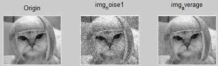

source code: 

```matlab
%% 图像平均
img_orig4 = rgb2gray(imread('cat.jpg'));
img_noise1 = imnoise(img_orig4, 'gaussian', 0, 0.01);
img_noise2 = imnoise(img_orig4, 'gaussian', 0, 0.01);
img_noise3 = imnoise(img_orig4, 'gaussian', 0, 0.01);
img_noise4 = imnoise(img_orig4, 'gaussian', 0, 0.01);
img_noise5 = imnoise(img_orig4, 'gaussian', 0, 0.01);
img_average = imlincomb(0.2,img_noise1, 0.2,img_noise2, 0.2,img_noise3, 0.2,img_noise4, 0.2,img_noise5);
figure();
subplot(1, 3, 1);
imshow(img_orig4);
title('Origin');
subplot(1, 3, 2);
imshow(img_noise1);
title('img_noise1');
subplot(1, 3, 3);
imshow(img_average);
title('img_average');
```

### 1.7 Histogram

#### 1.7.1 Histogram Equalization

直方图均衡化是一种常用的图像增强技术。假设我们有一个主要是黑色的图像。然后它的直方图会向灰度的下端倾斜，所有的图像细节都被压缩到直方图的暗端。如果能将暗端的灰度“拉伸”，生成一个更均匀分布的直方图，那么图像就会清晰得多。

具体做法：1. 求出原图的直方图分布 2.计算原图直方图的累计概率分布 3. 映射，公式可以表示为$f\left(D_{A}\right)=\frac{L}{A_{0}} \sum_{u=0}^{D_{A}} H_{A}(u)$，$A$为原图，$H$为直方图，$L$为灰度级，$A_0$为像素点个数。

### 1.7.2 adaptive histogram equalization

直方图均衡化中，是直接对全局图像进行均衡化，是Global Histogram Equalization，而没有考虑到局部图像区域(Local Region)，自适应直方图均衡化（AHE）就是在均衡化的过程中只利用局部区域窗口内的直方图分布来构建映射函数首先，最简单并且直接的想法，对A图像每个像素点进行遍历，用像素点周围W * W的窗口进行计算直方图变换的CDF（累计概率分布），然后对该像素点进行映射。[9]

### 1.7.3 Contrast Limited Adaptive Hitogram Equalization（CLAHE）

CLAHE相对于AHE，提出了两个改进的地方。

- 第一，提出一种限制直方图分布的方法。考虑图像A的直方图，设定一个阈值，假定直方图某个灰度级超过了阈值，就对 之进行裁剪，然后将超出阈值的部分平均分配到各个灰度级，这个过程可以用下图[10]来进行解释。图中左上图是原来的直方图分布，可以看出有两处峰值，其对应的CDF为左下图，可以看出有两段梯度比较大，变化剧烈。对于之前频率超过了阈值的灰度级，那么就把这些超过阈值的部分裁剪掉平均分配到各个灰度级上，如右上图，那么这会使得CDF变得较为平缓，如右下图。通常阈值的设定可以直接设定灰度级出现频数，也可以设定为占总像素比例，后者更容易使用。由于右下图所示的CDF不会有太大的剧烈变化，所以可以避免过度增强噪声点。[9]

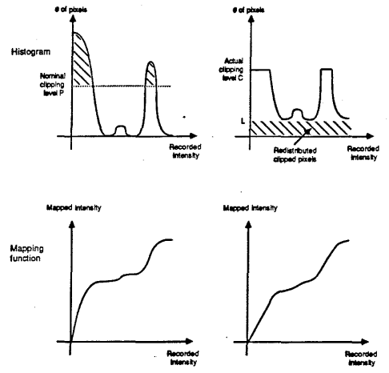

- 第二，提出了一种插值的方法，加速直方图均衡化。首先，将图像分块，每块计算一个直方图CDF，其次，对于图像的每一个像素点，找到其邻近的四个窗口，分别计算四个窗口直方图CDF对该点像素点的映射值，记作$f_{u l}(D), f_{u r}(D), f_{d l}(D), f_{d r}(D)$， 然后进行双线性插值得到最终该像素点的映射值，双线性插值(BiLinear)公式为$f(D)=(1-\Delta y)\left((1-\Delta x) f_{u l}(D)+\Delta x f_{b l}(D)\right)+\Delta y\left((1-\Delta x) f_{u r}(D)+\Delta x f_{b r}(D)\right)$

  其中$\Delta x, \Delta y$是像素点相对于左上角窗口中心，即左上角黑色像素点的距离与窗口大小的比值。[9]

实验结果(从左往右依次是原图，HE，AHE，CLAHE）：

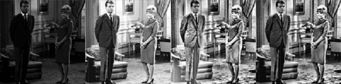

source code(hw_1):

```python 
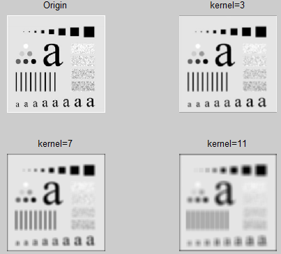//HE,AHE,CLAHE
import numpy as np
import argparse
import cv2

ap = argparse.ArgumentParser()
ap.add_argument('--image', required=True)
args = vars(ap.parse_args())

image = cv2.imread(args["image"])
image = cv2.cvtColor(image, cv2.COLOR_BGR2GRAY)

eh_image = cv2.equalizeHist(image)

ahe = cv2.createCLAHE(clipLimit=0.0, tileGridSize=(8,8))
ahe_image = ahe.apply(image)

clahe = cv2.createCLAHE(clipLimit=10.0, tileGridSize=(8,8))
clahe_image = clahe.apply(image)

cv2.imshow("Histogram Equalization", np.hstack([image, eh_image, 
                                                ahe_image, clahe_image]))
cv2.waitKey(0)
```

## 2. Mask Operations

掩模算子通过在图像上滑动掩模，将掩模值与落在它们下面的像素值相乘并获得总和，来执行掩模与图像的卷积。

可以表示为$g(x, y)=\sum_{s=-a}^{a} \sum_{t=-b}^{b} w(s, t) f(x+s, y+t)$，总和用作图像上掩模中心位置的值，$w(s, t)$即为掩模算子。

### 2.1 Smoothing operations

图像平滑是指用于突出图像的宽大区域、低频成分、主干部分或抑制图像噪声和干扰高频成分的图像处理方法，目的是使图像亮度平缓渐变，减小突变梯度，改善图像质量。$\begin{array}{|c|c|c|}\hline 1 & {1} & {1} \\ \hline 1 & {1} & {1} \\ \hline 1 & {1} & {1} \\ \hline\end{array}​$x$\frac{1}{9}​$就是一个用来平滑图像的掩模算子。

实验结果：


source code:

```matlab
img_orig5 = imread('a.png');
H1 = fspecial('average', 3);
img_smooth1 = imfilter(img_orig5, H1);
H2 = fspecial('average', 7);
img_smooth2 = imfilter(img_orig5, H2);
H3 = fspecial('average', 11);
img_smooth3 = imfilter(img_orig5, H3 );
figure();
subplot(2, 2, 1);
imshow(img_orig5);
title('Origin');
subplot(2, 2, 2);
imshow(img_smooth1);
title('kernel=3');
subplot(2, 2, 3);
imshow(img_smooth2);
title('kernel=7');
subplot(2, 2, 4);
imshow(img_smooth3);
title('kernel=11');
```

### 2.2 Median Filtering

中值滤波是基于排序统计理论的一种能有效抑制噪声的非线性信号处理技术，中值滤波的基本原理是把数字图像或数字序列中一点的值用该点的一个邻域中各点值的中值代替，让周围的像素值接近的真实值，从而消除孤立的噪声点。

实验结果：

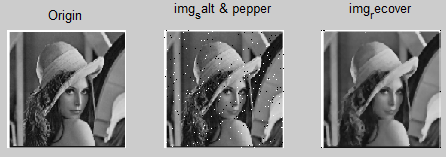

source code:

```matlab
%% 中值滤波
img_orig6 = rgb2gray(imread('lena.png'));
img_noise6=imnoise(img_orig6, 'salt & pepper', 0.02);
img_recover = medfilt2(img_noise6);
figure();
subplot(1, 3, 1);
imshow(img_orig6);
title('Origin');
subplot(1, 3, 2);
imshow(img_noise6);
title('img_salt & pepper');
subplot(1, 3, 3);
imshow(img_recover);
title('img_recover');
```

### 2.3 sharpening operations

图像锐化*(image sharpening)*是补偿图像的轮廓，增强图像的边缘及灰度跳变的部分，使图像变得清晰，分为空间域处理和频域处理两类。图像锐化是为了突出图像上地物的边缘、轮廓，或某些线性目标要素的特征。这种滤波方法提高了地物边缘与周围像元之间的反差，因此也被称为边缘增强。实验用的sobel算子对图像进行锐化。

实验结果：

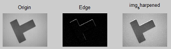

source code:

```matlab
%% 锐化
img_orig7 = imread('t.png');
H5 = fspecial('sobel');
edge = imfilter(img_orig7, H5);
sharpened = img_orig7 + edge;
figure();
subplot(1, 3, 1);
imshow(img_orig7);
title('Origin');
subplot(1, 3, 2);
imshow(edge);
title('Edge');
subplot(1, 3, 3);
imshow(sharpened);
title('img_sharpened');
```

### 2.4 Derivative operations

常见的偏导算子有sobel算子和laplacian算子，sobel算子是一阶偏导算子，laplacian算子是二阶偏导算子。

sobel算子有两个方向$Gx = \left[ \begin{array}{ccc}{-1} & {0} & {+1} \\ {-2} & {0} & {+2} \\ {-1} & {0} & {+1}\end{array}\right]$，$Gy = \left[ \begin{array}{ccc}{-1} & {-2} & {-1} \\ {0} & {0} & {0} \\ {+1} & {+2} & {+1}\end{array}\right]$，laplacian常见的算子有四邻域$\left[ \begin{array}{ccc}{ 0 } & { 1 } & { 0 } \\ { 1 } & { -4 } & { 1 } \\ { 0 } & { 1 } & { 0 }\end{array}\right]$, 八领域$\left[ \begin{array}{ccc}{ 1 } & { 1 } & { 1 } \\ { 1 } & { -8 } & { 1 } \\ { 1 } & { 1 } & { 1 }\end{array}\right]$.

实验结果：

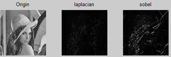

```matlab
%% 偏导
img_orig7 = rgb2gray(imread('lena.png'));
H6 = fspecial('laplacian');
H7 = fspecial('sobel');
laplacian = imfilter(img_orig7, H6);
sobel = imfilter(img_orig7, H7);
figure();
subplot(1, 3, 1);
imshow(img_orig7);
title('Origin');
subplot(1, 3, 2);
imshow(laplacian);
title('laplacian');
subplot(1, 3, 3);
imshow(sobel);
title('sobel');
```

## 3. Transform operations

这一节是将图片从空间域转到频域，在频域进行操作，公式表示为$G(u, v)=F(u, v) H(u, v)$，$F(u, v)$是原图经过快速傅里叶变换转换（Fast Fourier Transform, 简称fft）到频域的频谱，$H(u, v)$是在频域执行的操作，$G(u,v)$是在频域处理后的频谱结果，最后$G(u, v)$可以通过快速傅里叶反变换(ifft)得到滤波的图像。

### 3.1 Low pass filtering

流程：1） 原始正常的图像，加噪处理，得到img_noise； 2） img_noise图像进行傅里叶变换，得到频谱； 3） 对得到的频谱进行理想低通滤波，低于截止频率$d_0​$的通过，高于的抑制； 4） 对滤波后的频谱进行反傅里叶变换，得到滤波后图像。[2]

实验结果：


source code:

```matlab
%% 低通滤波, ref[2]
img_origin=rgb2gray(imread('lena.png'));
d0=50;  %阈值
img_noise=imnoise(img_origin,'salt'); % 加椒盐噪声
img_f=fftshift(fft2(double(img_noise)));  %傅里叶变换得到频谱
[m n]=size(img_f);
m_mid=fix(m/2);  
n_mid=fix(n/2);  
img_lpf=zeros(m,n);

for i=1:m
    for j=1:n
        d=sqrt((i-m_mid)^2+(j-n_mid)^2);   %理想低通滤波，求距离
        if d<=d0
            h(i,j)=1;
        else
            h(i,j)=0;
        end
        img_lpf(i,j)=h(i,j)*img_f(i,j);  
    end
end

img_lpf=ifftshift(img_lpf);    %反傅里叶变换
img_lpf=uint8(real(ifft2(img_lpf)));  %取实数部分

subplot(1,3,1);imshow(img_origin);title('原图');
subplot(1,3,2);imshow(img_noise);title('噪声图');
subplot(1,3,3);imshow(img_lpf);title('理想低通滤波');
```

### 3.2 High pass filtering

高通滤波与低通滤波类似，区别在于低于截止频率的抑制，高于截止频率的通过。

实验结果：

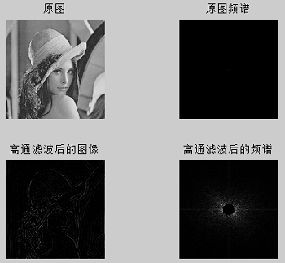

source code:

```matlab
%% 高通滤波
img_origin8 = rgb2gray(imread('lena.png'));
g= fftshift(fft2(double(img_origin8)));
[N1,N2]=size(g);
n=2;
d0=30; 
%d0是终止频率
n1=fix(N1/2);
n2=fix(N2/2);
%n1，n2指中心点的坐标，fix()函数是往0取整
for i=1:N1
  for j=1:N2
      d=sqrt((i-n1)^2+(j-n2)^2);  
    if d>=d0
        h=1;  
    else
        h=0;  
    end  
    result(i,j)=h*g(i,j); 
  end
end
final=ifft2(ifftshift(result));
final=uint8(real(final));
figure();
subplot(2,2,1); imshow(img_origin8); title('原图');
subplot(2,2,2); imshow(abs(g),[]); title('原图频谱');
subplot(2,2,3); imshow(final); title('高通滤波后的图像');
subplot(2,2,4); imshow(abs(result), []); title('高通滤波后的频谱');
```

### 3.3 Band pass filtering

带通滤波有两个截止频率$d_0$, $d_1$，其中$d_0$是较低的频率，$d_1$是较高的频率，图像频谱在$[d_0, d_1]​$之间的通过，在区间之外的抑制。

实验结果：

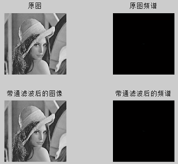

source code:

```matlab
%% 带通滤波
img_origin9=rgb2gray(imread('lena.png')); 
g= fftshift(fft2(double(img_origin9))); 
[N1,N2]=size(g);  
n=2;  
d0=0;  
d1=200;  
n1=floor(N1/2);  
n2=floor(N2/2);  
for i=1:N1  
   for j=1:N2  
    d=sqrt((i-n1)^2+(j-n2)^2);  
    if d>=d0 || d<=d1  
        h=1;  
    else
        h=0;  
    end  
    result(i,j)=h*g(i,j);
   end  
end 
final=ifft2(ifftshift(result));
final=uint8(real(final));
figure();
subplot(2,2,1); imshow(img_origin9); title('原图');
subplot(2,2,2); imshow(abs(g),[]); title('原图频谱');
subplot(2,2,3); imshow(final); title('带通滤波后的图像');
subplot(2,2,4); imshow(abs(result), []); title('带通滤波后的频谱');
```

### 3.4 Homomorphic filtering

同态滤波是把频率过滤和灰度变换结合起来的一种图像处理方法，它依靠图像的照度/ 反射率模型作为频域处理的基础，利用压缩亮度范围和增强对比度来改善图像的质量。使用这种方法可以使图像处理符合人眼对于亮度响应的非线性特性，避免了直接对图像进行傅立叶变换处理的失真。[8]

同态滤波的基本原理是：将像元灰度值看作是照度和反射率两个组份的产物。由于照度相对变化很小，可以看作是图像的低频成份，而反射率则是高频成份。通过分别处理照度和反射率对灰度值的影响，达到揭示阴影区细节特征的目的。[8]

流程：$S(x, y) ---> Log ---> FFT--->filter--->IFFT--->Exp--->T(x, y)$[8]

实验结果：

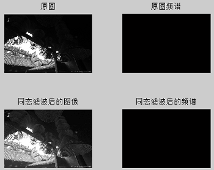

```matlab
%% 同态滤波 ref[8]
img_origin10 = rgb2gray(imread('water.png')); 
[M,N]=size(img_origin10);
rL=0.5;
rH=4.7;
c=2;
d0=10;
log_img=log(double(img_origin10)+1);
FI=fft2(log_img);
n1=floor(M/2);
n2=floor(N/2);
for i=1:M
    for j=1:N
        D(i,j)=((i-n1).^2+(j-n2).^2);
        H(i,j)=(rH-rL).*(exp(c*(-D(i,j)./(d0^2))))+rL;%高斯同态滤波
    end
end
G = H.*FI;
final=ifft2(G);
final=real(exp(final));
figure();
subplot(2,2,1); imshow(img_origin10); title('原图');
subplot(2,2,2); imshow(abs(FI),[]); title('原图频谱');
subplot(2,2,3); imshow(final, []); title('同态滤波后的图像');
subplot(2,2,4); imshow(abs(G), []); title('同态滤波后的频谱');
```

## 4. Coloring Operations

### 4.1 False coloring

将彩色图像转换为灰度图像是一个不可逆的过程，灰度图像也不可能变换为原来的彩色图像。而某些场合需要将灰度图像转变为彩色图像；伪彩色处理主要是把黑白的灰度图像或者多波段图像转换为彩色图像的技术过程。其目的是提高图像内容的可辨识度。

伪彩色图像的含义是，每个像素的颜色不是由每个基色分量的数值直接决定，而是把像素值当作彩色查找表(事先做好的)的表项入口地址，去查找一个显示图像时使用的R，G，B强度值，用查找出的R，G，B强度值产生的彩色称为伪彩色。

实验结果：

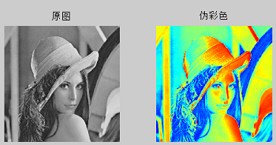

source code:

```matlab
%% 伪彩色
img_origin11 = rgb2gray(imread('lena.png')); 
FalseRGB = label2rgb(gray2ind(img_origin11, 255),jet(255));
figure();
subplot(1,2,1); imshow(img_origin11); title('原图');
subplot(1,2,2); imshow(FalseRGB); title('伪彩色');
```

### 4.2 Full color processing

上面处理的都是灰度图像，如果要处理全彩色图像，则需要对彩色的每个通道分别处理，然后叠加在一起。下面以中值滤波为例，对彩色图像进行处理。

实验结果:

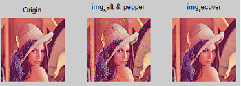

source code:

```matlab
%% 全彩色处理，中值滤波为例
img_orig6 = imread('lena.png');
for i = 1:3
img_noise6(:, :, i) = imnoise(img_orig6(:, :, i), 'salt & pepper', 0.02);
img_recover(:, :, i) = medfilt2(img_noise6(:, :, i));
end
figure();
subplot(1, 3, 1);
imshow(img_orig6);
title('Origin');
subplot(1, 3, 2);
imshow(img_noise6);
title('img_salt & pepper');
subplot(1, 3, 3);
imshow(img_recover);
title('img_recover');
```

## Reference

[1] <http://homepages.inf.ed.ac.uk/rbf/HIPR2/hipr_top.htm>

[2] <https://blog.csdn.net/ytang2_/article/details/75451934>

[3] <https://baike.baidu.com/item/Sobel%E7%AE%97%E5%AD%90/11000092?fr=aladdin>

[4] <http://www.eie.polyu.edu.hk/~enyhchan/imagee.pdf>

[5] <http://www.eletel.p.lodz.pl/mstrzel/imageproc/enhancement1.PDF>

[6] <https://arxiv.org/ftp/arxiv/papers/1003/1003.4053.pdf>

[7] <https://ieeexplore.ieee.org/stamp/stamp.jsp?tp=&arnumber=8076993>

[8] <https://blog.csdn.net/scottly1/article/details/42705271#commentBox>

[9] <https://zhuanlan.zhihu.com/p/44918476>

[10] <http://citeseerx.ist.psu.edu/viewdoc/download?doi=10.1.1.294.8423&rep=rep1&type=pdf>

